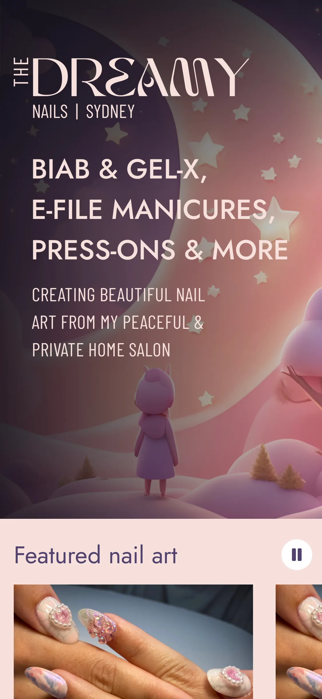

# The Dreamy Nails Website

[https://thedreamynails.com](https://thedreamynails.com)

Website for The Dreamy Nails, a client with a home studio for manicures and nail art.

I'm developing this site for free as a favour, and in exchange, the business owner is allowing me to make the source code public.

Current design is MVP; logo and colour palette were pre-existing, and things like spacing and fonts can be greatly improved. The client has asked for my help refreshing all branding with their input after the initial launch (getting deployed and indexed by search engines is priority).

## Current priorities

### Minor content tweaks and image improvements

Adding a couple of content sections to improve SEO (e.g. what is BIAB) + cross-links. Manually converting current images to optimised AVIF files.

### v2 design & branding refresh

Currently in progress. Complete overhaul including new logo and typography refresh.



### Optimised image handling

Currently researching best practices for serving optimised images.

I've made the decision to use Cloudinary for image hosting and dynamic optimisation; being able to resize, remove backgrounds, etc while automatically serving the best format for the given user agent will give a huge boost to performance and cut down massively on manual image processing/exporting overhead.

This will be implemented with v2 once designs are complete

### Next steps (roughly prioritised, post-v2)
* unit testing & storybook docs for new components
  * Currently researching how to test server & client components
* Add logging for edge fn's (https://vercel.com/docs/observability/runtime-logs)
* headings - move responsive max width logic to wrapper elements, headings always full width 
* add faq page
* extract more components (List&List.Item? Text?)
* integrate booking system
* error boundaries
* extended desktop breakpoint (1200px)
* integrate shopify
* Implement end-to-end tests
* accessibility audit & optimisation
* performance audit & optimisation

## Getting started

For local development:

```
pnpm run dev
```

## Core Features

TODO
Google Analytics
Instagram basic display API
Edge Functions (/app/api folder)

## Discussion & decisions made

### Testing

I've temporarily decided to forego testing for two reasons:
1. we want a web presence ASAP, and I'm rapidly prototyping and refactoring and iterating without working from designs. Maintaining tests in this bootstrapping phase would be very inefficient and only delay the soft launch.
2. A redesign is on the horizon, meaning even more major component changes.

When I start the v2 build, I'll be creating designs before I start building, and have the time needed to test as I build.

### Branching strategy

Now that the [website](https://www.thedreamynails.com) is live, I'll be using gitflow. Even though I'm the only dev currently, it is useful for documenting changes and being able to more easily revert changes if necessary. Also, Vercel creates preview branches automatically for pull requests 🥳

### Framework

TODO: talk about originally using Remix 

### Environment variables

As far as I can tell from docs, the env vars in `/env.local` are used by NextJS both for your local dev server, AND by Vercel when deploying, if so desired. However, since this is a public repo, I don't want API tokens exposed, so can't commit `.env` files for different environments. I'll be using Vercel's built-in platform features.

If forking this site and deploying elsewhere, you'll need to provide your own values (e.g. sign up for your own Instagram API token, Google Analytics account, etc) and figure out how to make them available in production.

## License

This source code is open source, licensed under `GNU GPLv3`. You can [learn about this license type here](https://choosealicense.com/licenses/gpl-3.0/).

> Permissions of this strong copyleft license are conditioned on making available complete source code of licensed works and modifications, which include larger works using a licensed work, under the same license. Copyright and license notices must be preserved. Contributors provide an express grant of patent rights.